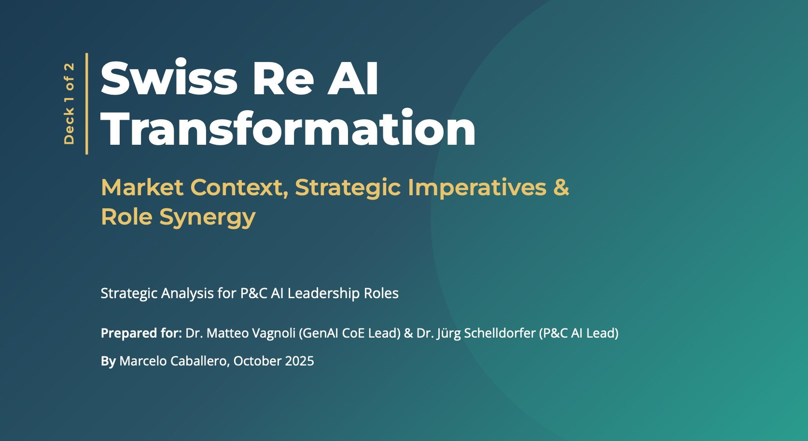
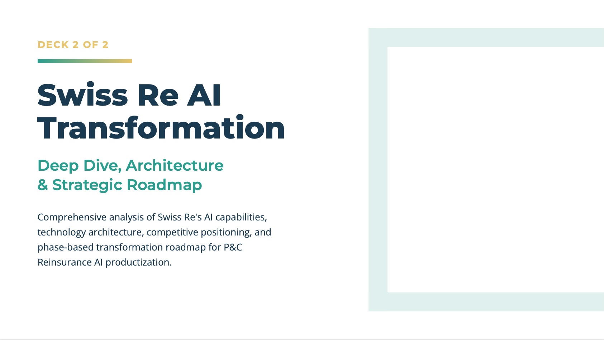

-----

# Swiss Re AI Transformation Strategy

A ready-to-use playbook designed for   
**The Swiss Re P&C Reinsurance AI Productization Journey**   
(Work Sample for AI Leadership Roles)

-----

**Author:** Marcelo Caballero, MSc AI, MBA  
**Target Roles:** AI Product Delivery Lead • AI Product Strategist / Product Owner  
**Length:** Deck 1 — 11 slides • Deck 2 — 12 slides  
**Sources:** Public information only  

<table>
  <thead>
    <tr>
      <th align="center">Deck 1: Strategic Context</th>
      <th></th>
      <th align="center">Deck 2: AI Deep Dive</th>
    </tr>
  </thead>
  <tbody>
    <tr>
      <td align="center">
        
      </td>
      <td align="center"> │ </td>
      <td align="center">
        
      </td>
    </tr>
  </tbody>
</table>

-----

## Purpose

To **deliver value before day one**. This is not a theoretical exercise. It is a ready-to-use strategic playbook tailored to Swiss Re's specific market position and internal needs. It frames the business context, diagnoses the core **execution gap** in the P\&C AI portfolio, and provides a pragmatic delivery roadmap. The decks are designed to provide immediate clarity for executives, hiring managers, and delivery teams on how to turn AI ambition into shipped products with measurable P\&L impact.

-----

## Why this matters

This is proof of how I operate: I deliver value from the outset. This work sample demonstrates the strategic analysis, technical judgment, and operational credibility required to lead Swiss Re's P\&C AI transformation. It turns an ambiguous mandate into a clear plan with defined ownership, a delivery cadence, and a direct line to business impact.

-----

## What Sets This Work Apart

  - **A Ready-to-Use Playbook:** This analysis provides a tailored operating model for the P\&C AI portfolio, defining governance, team topology, and a platform roadmap so strategy and execution are one system from the start.
  - **From Strategy to Shipped Systems:** It demonstrates a clear, logical path from high-level business challenges (combined ratio pressure) to specific technical solutions (GenAI Underwriting Co-Pilot) and the MLOps infrastructure required to deliver them at scale.
  - **Clarity on Both Roles:** The decks remove the ambiguity between the two open requisitions, defining a complementary **"Tandem Model"** where the Delivery Lead and Product Strategist collaborate to bridge enterprise governance with P\&C business execution.

-----

## Who this is for

  - **Swiss Re Hiring Managers and Stakeholders** in P\&C Re (Dr. Schelldorfer) and the GenAI CoE (Dr. Vagnoli).
  - **Product, data, ML, and platform leaders** tasked with delivering AI in a regulated enterprise.
  - **Executives** who need an AI strategy anchored to clear business outcomes.

-----

## How to review

1.  **Start with Deck 1 for the strategic context and diagnosis (the "Why"):**
      - Read the **Executive Summary** and **Execution Gap** framing.
      - Review the competitive AI maturity snapshot across reinsurers.
      - Note the stakeholder alignment and the **"dual-fluency"** message.
2.  **Move to Deck 2 for the operating model and execution plan (the "How"):**
      - Review the **Role Cooperation Model** and the stakeholder/KPI ownership map.
      - Examine the **Target-State Architecture** concept.
      - Review the **30-90-365 Day Roadmap** and its link to measurable outcomes.

-----

## What is inside

### Deck 1 — Market Context, Strategic Imperatives & Role Synergy

This deck establishes the strategic landscape, identifies the core challenge, and aligns the solution with key stakeholders.

  - **Executive Summary:** Acknowledges group strength but pivots to the P\&C profitability pressure, framing the need to convert AI ambition into shipped products.
  - **Competitive Positioning:** Diagnoses Swiss Re as an **"Ambitious Follower"** lagging Munich Re and SCOR on visible P\&C AI products.
  - **The Execution Gap:** Makes the clear diagnosis that Swiss Re faces an execution problem, not an ideas problem, justifying the creation of the two senior roles.
  - **Stakeholder Alignment:** Defines the need for a leader who can speak the language of the GenAI CoE (governance, agentic workflows) and the P\&C business (loss ratios, submission triage) simultaneously.

### Deck 2 — Deep Dive, Architecture & Strategic Roadmap

This deck provides the blueprint for action, detailing the target operating model, architecture, and a phase-based plan.

  - **Role Cooperation Model:** Defines the **"Tandem Model"** for the Delivery Lead ("When and Why") and the Strategist ("What and How"), mapping their decision rights and KPI ownership.
  - **Target Architecture:** Lays out a pragmatic architecture that builds on the Palantir/Azure foundation with a robust MLOps pipeline to accelerate P\&C model deployment.
  - **High-Priority Use Cases & Roadmap:** Details a **30-90-365 day plan** focused on high-impact initiatives like the GenAI Underwriting Assistant, targeting a **3-6 pp loss ratio improvement**.
  - **KPI Framework:** Implements a hierarchical framework that directly links AI system metrics (e.g., model accuracy) to top-line P\&C business objectives (e.g., combined ratio).

-----

## Repository contents

  - `Deck1_of_2.pdf` – The Strategic Context, Market Analysis, and Role Diagnosis
  - `Deck2_of_2.pdf` – The AI Deep Dive, Target Architecture, and Transformation Roadmap
  - `README.md` – This guide

**Files:** `Deck1_of_2.pdf`, `Deck2_of_2.pdf`

<!--
[Open Deck 1 on GitFront](https://gitfront.io/r/MScAI/Rj96cdzazX55/SwissRe/blob/Decks/Deck1_of_2.pdf) •
-->

[Open Deck 1 on GitHub](https://github.com/MSc-AGI/SwissRe/blob/main/Decks/Deck1_of_2.pdf) •
[Download PDF](https://gitfront.io/r/MScAI/Rj96cdzazX55/SwissRe/raw/Decks/Deck1_of_2.pdf)

[Open Deck 2 on GitHub](https://github.com/MSc-AGI/SwissRe/blob/main/Decks/Deck2_of_2.pdf) •
[Download PDF](https://gitfront.io/r/MScAI/Rj96cdzazX55/SwissRe/raw/Decks/Deck2_of_2.pdf)

-----

## Contact

I welcome the opportunity to discuss this analysis and my approach to driving AI value at Swiss Re.

Marcelo Caballero  
[msc\_ai@icloud.com](mailto:msc_ai@icloud.com)  
\+41 76 514 38 30
